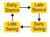

# Finite State Machine Controller

## Overview

The library ships with three example implementations of the same finite state machine (FSM) walking controller. The figure below shows the basic execution of the controller:



The first implementation is entirely in Python and uses the `StateMachine` class from the control subpackage of this library. If you plan to write your controllers exclusively in Python, this example is a good starting point.

The library also supports using compiled `C` and `C++` library functions via the `CompiledController` class. You can see a basic example of this module on the [tutorials page](../tutorials/control/compiled_controller.md), which may be helpful to review before starting with this example. We've duplicated the FSM behavior in both `C++` and `MATLAB`. The source code for these control implementations is available in [this repository](https://github.com/neurobionics/OSL_CompiledControllers_Source). Refer to the documentation in that repository for instructions on compiling both the `C++` and the `MATLAB` source code.

---

## Python Implementation

### Setup and Configuration

First, we'll perform some standard imports:

```python
--8<-- "examples/fsm_walking_python_controller.py:1:21"
```

Next, we'll define all the tunable FSM parameters. These include the impedance parameters for each state as well as the transitions between states:

```python
--8<-- "examples/fsm_walking_python_controller.py:23:65"
```

> **Note**:
> These parameters were roughly tuned for a moderately paced walking gait. You may want to tune them to better suit your intended use case.

Next, we create a function that returns an instance of the `StateMachine` class. We start by making `State` objects for each of our four states and the include the impedance parameters in each. We also define transition criteria functions that determine when to move between states. We add the states and transition functions to an instance of the `StateMachine` class, specifiying that the initial state is `e_stance`.

```python
--8<-- "examples/fsm_walking_python_controller.py:71:190"
```

> **Note**:
> If instantiating the OSL hardware and sensors is unfamiliar, check out the [the tutorials pages](../tutorials/actuators/getting_started.md).


Next, we initialize the standard actuators, sensors, logger, and loop classes for the OSL:
```python
--8<-- "examples/fsm_walking_python_controller.py:192:244"
```

We then call the FSM definition function we made above and initialize/home the hardware:
```python
--8<-- "examples/fsm_walking_python_controller.py:246:260"
```

### Main Loop

Now that everything is set up, we enter the main loop. During each iteration of the main loop, we call the update method for both the OSL and the FSM. We then write the current impedance parameters for each joint to the hardware. A print statement and logging are also included for debugging:

```python
--8<-- "examples/fsm_walking_python_controller.py:262:285"
```

### Full Code for The Python Implementation
```python
--8<-- "examples/fsm_walking_python_controller.py"
```


---

## C++ and MATLAB Implementation

To get started, ensure you have compiled either the `C++` or `MATLAB` source code and have a `FSMController.so` library. If not, refer to the [source repository](https://github.com/neurobionics/OSL_CompiledControllers_Source) for compilation instructions. To run this example, make sure the generated library is in the same directory as your script, or modify the search path for the library when loading the controller.

---

### Load Compiled Library

First, perform standard imports, handle paths, and set up the hardware for the OSL joints and sensors

```python
--8<-- "examples/fsm_walking_compiled_controller.py:11:59"
```

> **Note**:
> If instantiating the OSL hardware and sensors is unfamiliar, check out the [the tutorials pages](../tutorials/actuators/getting_started.md).

Next, instantiate a `CompiledController` wrapper object:

```python
--8<-- "examples/fsm_walking_compiled_controller.py:61:68"
```

---

### Define Custom Datatypes

Define the data structures used in the controller. These must match the size and order of the structures used to create the library.

```python
--8<-- "examples/fsm_walking_compiled_controller.py:70:121"
```

---

### Configure Impedance and Transition Parameters

Configure the impedance and transition parameters based on predefined tuning. Adjust these values to achieve the desired behavior:

```python
--8<-- "examples/fsm_walking_compiled_controller.py:124:159"
```

---

### Main Loop

After configuration, home the OSL joints, calibrate the loadcell, set the joints to impedance mode, and begin running the controller. During each loop iteration, update the inputs, call the `run()` method, and write outputs to the hardware:

```python
--8<-- "examples/fsm_walking_compiled_controller.py:161:209"
```

> **Note**:
> Be careful with units when writing outputs to the hardware. Convert values to the appropriate units if necessary.

---

### Full Code for The Compiled Controller Implementation

```python
--8<-- "examples/fsm_walking_compiled_controller.py"
```
